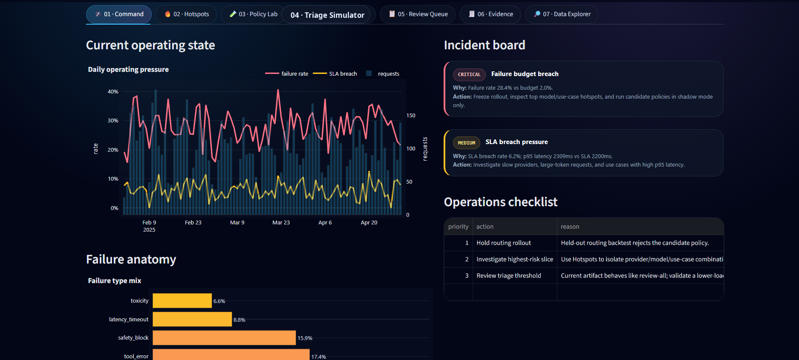

# 🛰️ LLMOps Telemetry Command Center

[](https://github.com/tarekmasryo/llmops-telemetry-command-center/actions/workflows/ci.yml)


**A decision-ready Streamlit command center for LLM reliability, latency, cost, routing-policy review, drift signals, triage thresholds, and operational evidence exports.**

LLMOps Telemetry Command Center turns offline LLM telemetry and evaluation artifacts into an operator-facing review workflow:

```text
telemetry data → validation → KPIs → hotspots → routing policy scenarios → triage simulation → review queue → evidence exports
```

This is an offline, self-contained review system: it does not call external LLM providers or require live telemetry infrastructure.



---

## ✨ What this dashboard does

- 📌 **Summarizes operational posture** across request volume, failure rate, p95 latency, cost, and health score.
- 🔥 **Ranks risk hotspots** by provider, model, use case, latency pressure, SLA breaches, failure rate, and cost.
- 🧪 **Separates held-out artifact evidence from live scenario review** so exploratory filters support investigation without changing audit artifacts.
- 🧭 **Simulates routing policy choices** with transparent assumptions around failure cost, SLA penalty, and minimum traffic.
- 🎯 **Explores triage thresholds** across review share, expected cost, precision, recall, and confusion-matrix trade-offs.
- 📋 **Builds a filter-aware review queue** for operational handoff and evidence review.
- 🧾 **Surfaces drift and decision artifacts** with controlled JSON expanders and clear status summaries.
- 📤 **Exports filtered operational evidence** for follow-up analysis, documentation, or release review.

---

## 🧭 Dashboard pages

| Page | Purpose |
|---|---|
| **Command** | Current operating state, KPI strip, incidents, and top risk slices |
| **Hotspots** | Provider/model/use-case segments driving reliability, latency, or cost pressure |
| **Policy Lab** | Held-out routing verdicts plus live filtered routing scenarios |
| **Triage Simulator** | Threshold, review-load, cost, precision, recall, and confusion-matrix analysis |
| **Review Queue** | Filter-aware triage queue with priority, reason, probability, latency, and cost fields |
| **Evidence** | Drift report, decision artifact, routing artifact, and raw evidence browser |
| **Data Explorer** | Searchable telemetry tables, cohorts, and instruction-template diagnostics |

---

## ✅ Key engineering details

- Uses a thin `app.py` entrypoint and a dedicated Streamlit view controller.
- Loads telemetry through a typed `DataBundle` with startup schema and integrity checks.
- Validates required CSV and JSON artifact contracts before rendering.
- Keeps notebook-generated artifacts as the audit source of truth.
- Applies sidebar filters only to live exploratory views and matched review queues.
- Uses explicit Plotly keys to prevent duplicate Streamlit element IDs.
- Renders custom UI through controlled helpers instead of raw Markdown HTML blocks.
- Keeps missing or invalid evidence visible through fail-fast checks rather than silent fallback charts.
- Includes unit, contract, chart, UI, policy, and project-quality tests.
- Ships with Docker, Docker Compose, CI, deployment notes, and release docs.
- Provides a cross-platform test runner for Windows, Linux, macOS, and GitHub Actions.

---

## 🧱 Architecture at a glance

```text
Bundled telemetry CSVs + notebook artifacts
                |
                v
        src.data.load_bundle()
                |
        schema checks + type coercion
        artifact contract validation
        cross-table integrity checks
                |
                v
             DataBundle
                |
    +-----------+-----------+-----------+
    |                       |           |
src.metrics              src.policy   src.charts
KPIs, hotspots,          routing +    Plotly figures
queues, cohorts          triage
    |                       |           |
    +-----------+-----------+-----------+
                |
                v
          src.dashboard
       Streamlit workflow tabs
                |
                v
             src.ui
   cards, safe HTML helpers, tables
```

For the full design, see [`docs/architecture.md`](docs/architecture.md). For bundled file checksums and row counts, see [`docs/artifact_manifest.md`](docs/artifact_manifest.md).

---

## 📦 Project structure

```text
llmops-telemetry-command-center/
├── app.py
├── requirements.txt
├── requirements-dev.txt
├── pyproject.toml
├── README.md
├── CONTRIBUTING.md
├── LICENSE
├── CHANGELOG.md
├── DEPLOYMENT.md
├── VERSION
├── Dockerfile
├── docker-compose.yml
├── Makefile
├── assets/
│   └── preview.png
├── artifacts/
│   ├── decision_artifact.json
│   ├── drift_report.csv
│   ├── routing_backtest_summary.csv
│   ├── routing_policy_use_case.csv
│   ├── triage_actions_preview.csv
│   ├── triage_baseline_comparison.csv
│   ├── triage_threshold_curve.csv
│   └── triage_threshold_policy.json
├── data/
│   ├── llm_system_interactions.csv
│   ├── llm_system_sessions_summary.csv
│   ├── llm_system_users_summary.csv
│   ├── llm_system_prompts_lookup.csv
│   └── llm_system_instruction_tuning_samples.csv
├── docs/
│   ├── architecture.md
│   ├── artifact_provenance.md
│   ├── artifact_manifest.md
│   ├── data_dictionary.md
│   ├── operational_boundaries.md
│   └── testing_strategy.md
├── scripts/
│   ├── docker_smoke_test.py
│   └── run_tests.py
├── src/
│   ├── __init__.py
│   ├── charts.py
│   ├── dashboard.py
│   ├── data.py
│   ├── metrics.py
│   ├── models.py
│   ├── policy.py
│   ├── ui.py
│   └── views/
│       ├── command.py
│       ├── data_explorer.py
│       ├── evidence.py
│       ├── hotspots.py
│       ├── overview.py
│       ├── policy_lab.py
│       └── triage.py
├── tests/
│   ├── conftest.py
│   ├── test_artifact_contracts.py
│   ├── test_bundle_contract.py
│   ├── test_charts.py
│   ├── test_command_view.py
│   ├── test_data.py
│   ├── test_metrics.py
│   ├── test_policy.py
│   ├── test_project_quality.py
│   └── test_ui.py
└── .github/workflows/ci.yml
```

---

## 📊 Included data and artifacts

The repository includes synthetic/offline telemetry files for a frictionless first run:

| File | Role |
|---|---|
| `data/llm_system_interactions.csv` | Request-level telemetry and outcome fields |
| `data/llm_system_sessions_summary.csv` | Session-level rollups |
| `data/llm_system_users_summary.csv` | User/account-level synthetic summaries |
| `data/llm_system_prompts_lookup.csv` | Prompt and instruction metadata |
| `data/llm_system_instruction_tuning_samples.csv` | Instruction-template examples |
| `artifacts/decision_artifact.json` | Notebook-generated decision artifact |
| `artifacts/routing_backtest_summary.csv` | Held-out routing-policy backtest summary |
| `artifacts/triage_threshold_policy.json` | Offline triage policy metadata |
| `artifacts/triage_threshold_curve.csv` | Threshold/cost/review-load curve |
| `artifacts/triage_actions_preview.csv` | Review-queue preview artifact |

The included data is synthetic and does not contain real customer, billing, incident, or user records. It is intentionally bundled with the repository so the dashboard can run immediately after cloning without external services, private datasets, or notebook regeneration steps.

---

## ⚖️ Artifact evidence vs live scenario review

This project deliberately separates two scopes:

1. **Held-out evaluation artifacts**  
   Notebook-generated outputs such as routing backtests, triage curves, drift reports, and decision artifacts. These are treated as audit evidence.

2. **Live filtered scenario review**  
   Sidebar filters, operator knobs, routing assumptions, and queue filters. These support investigation and candidate review while held-out artifacts remain the audit trail.

This design keeps the interface useful for operational analysis while preserving a clean separation between evidence review and rollout approval.

---

## 🚀 Run locally

Create a fresh virtual environment:

```bash
python -m venv .venv
```

Activate it.

Windows PowerShell:

```powershell
.venv\Scripts\Activate.ps1
```

macOS/Linux:

```bash
source .venv/bin/activate
```

Install dependencies and run:

```bash
pip install -r requirements.txt
streamlit run app.py
```

Open:

```text
http://localhost:8501
```

---

## 🐳 Run with Docker

Build the image:

```bash
docker build -t llmops-telemetry-command-center .
```

Run the app:

```bash
docker run --rm -p 8501:8501 llmops-telemetry-command-center
```

Production-style Docker validation:

```bash
python scripts/docker_smoke_test.py --image llmops-telemetry-command-center:ci --build
```

Or use Docker Compose:

```bash
docker compose up --build
```

---

## 🧪 Validate locally

Install development dependencies:

```bash
pip install -r requirements.txt -r requirements-dev.txt
```

Run the same checks used by CI:

```bash
python -m ruff check app.py src tests scripts
python -m ruff format --check app.py src tests scripts
python -m compileall app.py src tests scripts
python scripts/run_tests.py
```

Or use:

```bash
make check
```

Expected result:

```text
Ruff passes, compileall completes, and the full pytest suite passes.
```

The repository is CI-tested on Python `3.11` and `3.12`. CI also validates Docker image build and runtime health through a Streamlit smoke test.

---

## 🌐 Deployment targets

This project is suitable for:

- GitHub technical repository
- Streamlit Community Cloud
- Hugging Face Spaces with `sdk: streamlit`
- Docker-based local walkthroughs
- Internal technical review sessions over offline telemetry artifacts

See [`DEPLOYMENT.md`](DEPLOYMENT.md) for deployment commands and runtime assumptions.

---

## 🛡️ Data and operations note

The command center uses synthetic/offline telemetry and notebook-generated artifacts. It is designed for LLMOps analysis, evaluation review, routing-policy inspection, triage-threshold planning, and dashboard engineering.

A live operating environment would add telemetry ingestion, persistence, authentication, access controls, alert delivery, service monitoring, and scheduled artifact refresh jobs around this interface.

---

## 📄 License

MIT License. See [`LICENSE`](LICENSE).
